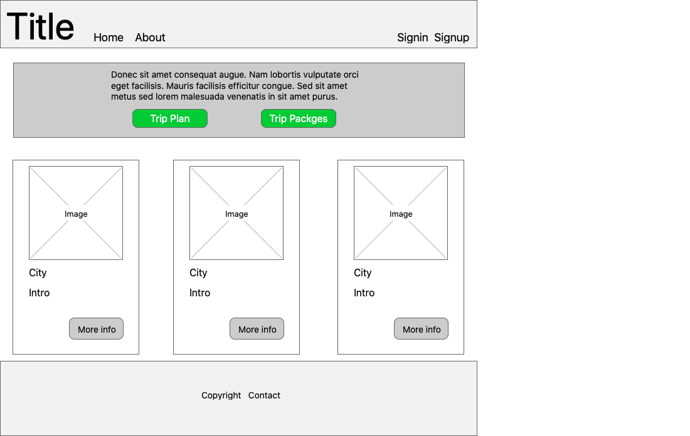
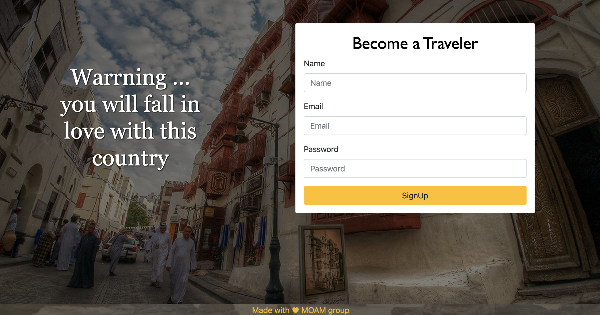
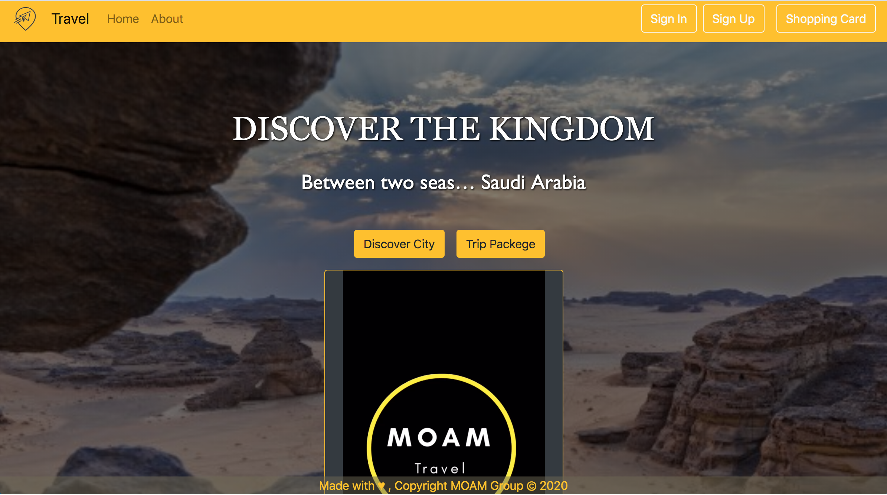
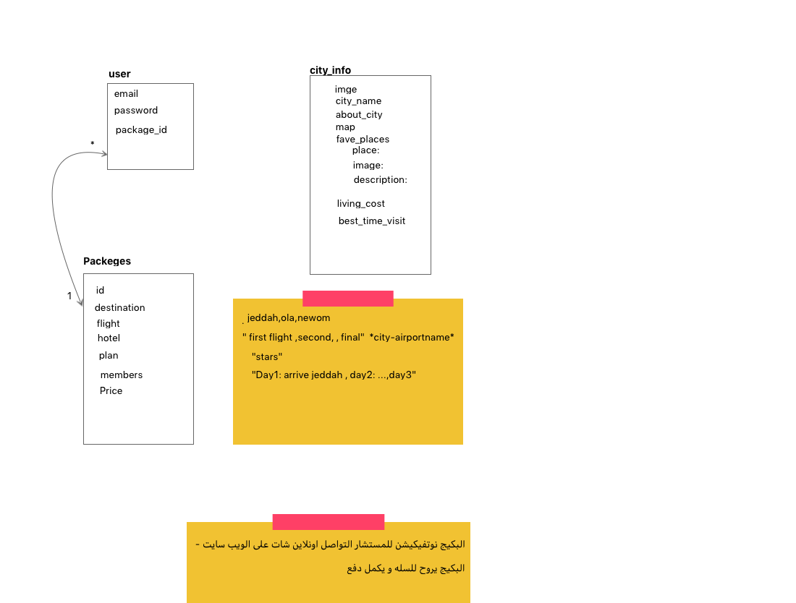
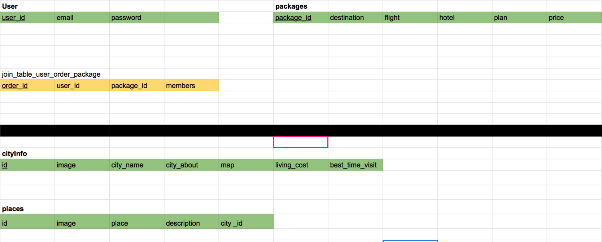

[](https://generalassemb.ly/education/web-development-immersive)

## Travel Agency website
### Idea
A Full-stack application for discovering kingdom Saudi Arabia city that provides paid trip packages  

### Project Feature
- user browse city information & famouse places in that city
- website offers paid trip packages
- user order packages (must be regesterd)


### Wireframes



###  Screenshot of the app


### Entity Relationship Diagram (ERD)


### Schema Diagram 

### Catalog of routes 
| route | method | Description |
|:-----------|:---------------|-------------|
| `'city_information'` | `Get` | return all city information |
| `'place'` | `Get` | return all famous places in city information |
| `'package'` | `Get` | return all trip package information |
| `'users/signup'` | `Post` | siginup user |
| `'/auth/login'` | `Post` | login user |
| `'/auth/current_user'` | `Get` | return current user information |
| `'orderCreate'` | `Post` | create order for user |
| `'orderList'` | `Get` | return all order information for user |
| `'orderDelete/:id'` | `Delete` | delete order information for user |

### Set up and installation instructions In your terminal
```
- yarn install --check-files
- bundle install
- rake db:drop 
- rake db:setup
- rake db:migrate
- rails s
```
### Deployment link 
```
https://travel-agency-moam-team.herokuapp.com
```
